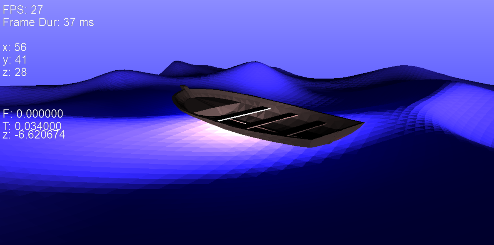

# Custom-3D-Software-Rendering-Engine

This is a rendering engine that I developed in C from scratch without using any library. I used gerstner ocean wave model to animate an ocean surface.
*Current Features:
*depth-buffering for the painters problem.
*triangle rasterization
*wavefront file format loading
*triangle mesh generation
*FPS counter and limiter
*pixel buffer masking (for removing water inside the boat)
*resiable window size without blocking the program (I used seprate threads for handling client messages and for the main program)
*Used multithreading for rendering triangles, and smiulating the environment dyanmics.
*Implemented triangle clipping algotihm for optimizing the rasterization process.
